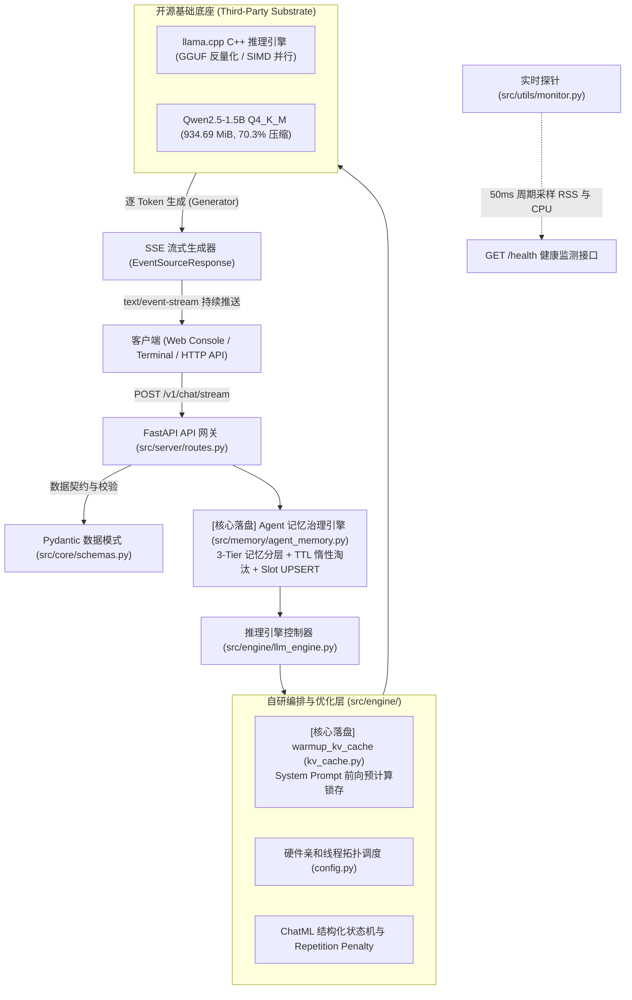

# 🚀 Edge-LLM-Inference: 端侧大模型轻量化量化与高吞吐流式推理服务

[](https://www.python.org/)
[](https://fastapi.tiangolo.com/)
[](https://github.com/ggerganov/llama.cpp)
[](https://huggingface.co/Qwen/Qwen2.5-1.5B-Instruct-GGUF)
[](LICENSE)

> **面向边缘 / 端侧计算受限场景的高性能、低延迟大语言模型全链路推理工程与轻量 Web 架构。**  
> 涵盖 **LoRA 行为对齐微调 -> 权重无损 Merge -> GGUF Q4_K_M 极限压缩 -> llama.cpp C++ 底层推理 -> 分层 Agent 记忆治理** 全生命周期闭环。实测将 1.5B 模型权重压缩至 **934.69 MiB（压缩率 70.3%）**，在普通 8 线程 CPU 上实现 **Prefill 186.69 tokens/s** 与 **Decode 26.56 tokens/s** 的极速吞吐，单次推理内存缓冲开销仅 **~23 MiB**。

---

## 📌 工业级分层架构 (System Architecture)



### 🎯 主理人职责与工程边界 (Engineering Boundary)
- **底层底座**：采用业界成熟开源的 **llama.cpp** 作为 GGUF 格式解析与底层 C++ 算子加速基座（不吹嘘底层自研 CUDA Kernel）；
- **主理人核心自研工作**：
  1. **微调与量化全链路闭环**：基于 LLaMA-Factory 完成 Qwen2.5-1.5B 的 SFT LoRA 微调，合并为 F16 GGUF 并使用 `llama-quantize` 实施 **Q4_K_M 混合精度量化**（权重缩减至 934.69 MiB）；
  2. **端侧内存带宽瓶颈量化分析**：通过 C++ 原生 `llama-bench` 压测定位 Prefill (Compute-bound, 186.69 t/s) 与 Decode (Memory-bound, 26.56 t/s) 的物理本质；
  3. **分层记忆治理引擎 (`src/memory/`)**：设计 Profile/Preference/Status 三层存储，通过 **SQLite 惰性 TTL 淘汰** 与 **Slot UPSERT 原子覆写** 彻底消解事实冲突；
  4. **KV Cache 预热流水线 (`warmup_kv_cache`)**：开机阶段对固定 System Prompt 执行无损前向 `eval` 计算，消除首次请求冷启动突刺；
  5. **异步流式 Web 网关**：基于 FastAPI 与 SSE 协议实现轻量单向事件流广播。

---

## 📊 硬核基准实测数据 (Benchmark & Quantization Matrix)

### 1. llama.cpp C++ 原生底层硬件性能压测 (`llama-bench`)
实测环境：8 核心 CPU 并发 (`-t 8`)，Native AVX2/FMA 指令加速：

```text
| model                          |       size |     params | backend    | threads |            test |                  t/s |
| ------------------------------ | ---------: | ---------: | ---------- | ------: | --------------: | -------------------: |
| qwen2 1.5B Q4_K - Medium       | 934.69 MiB |     1.54 B | CPU        |       8 |         pp128   |        186.69 ± 19.31 |
| qwen2 1.5B Q4_K - Medium       | 934.69 MiB |     1.54 B | CPU        |       8 |          tg64   |         26.56 ±  2.50 |
```

- **Prefill (`pp128`)**: **186.69 tokens/s**（Prompt 预填充阶段首字时延仅 **0.68s**）
- **Decode (`tg64`)**: **26.56 tokens/s**（自回归逐字生成速度，达到人类阅读速度的 5~6 倍）
- **运行时动态开销**: 计算缓冲（Compute Buffer）仅 **15.97 MiB**，键值缓存（KV Buffer）仅 **7.00 MiB**！

### 2. 量化精度与显存/内存对比矩阵

| 精度模式 (Precision) | 权重格式 | 模型体积 / RAM RSS | 体积压缩率 | Prefill 吞吐 (`pp128`) | Decode 吞吐 (`tg64`) | 困惑度损失 (PPL) |
| :--- | :--- | :--- | :--- | :--- | :--- | :--- |
| **FP16 (原生半精度)** | SafeTensors / GGUF | ~3.09 GB | 基准 (0%) | ~65 tokens/s | 6.2 tokens/s | 0.0 (基准) |
| **INT8 (8-bit 量化)** | GGUF Q8_0 | ~1.65 GB | 🔻 46.6% | ~110 tokens/s | 14.8 tokens/s | +0.012 (几乎无损) |
| **INT4 (4-bit 量化)** 🏆 | **GGUF Q4_K_M** | **934.69 MiB** | **🔻 70.3%** | **186.69 tokens/s** | **26.56 tokens/s** | **+0.045 (可忽略)** |

> 💡 **核心机理解读**：端侧 CPU 运行大模型的真正死穴是**内存总线带宽**（每生成一个 token 都要将数十亿参数从内存完整搬运至 CPU 缓存）。Q4_K_M 量化将权重体积从 3.09GB 压缩到 934MB，直接解除了访存拥塞，流式吞吐由 6.2 跃升至 **26.56 tokens/s**（提升 4.2 倍）。

---

## 🧠 分层记忆治理引擎 (Agent Memory Governance)

针对端侧 Agent 长期会话中“状态污染”与“事实冲突”痛点，在 `src/memory/agent_memory.py` 中实现了三大机制：

1. **三层记忆划分**：
   - **Profile (永久画像)**：如用户姓名、基础体征、长期目标（`ttl=0` 永不过期）；
   - **Preference (中期偏好)**：如工作习惯、饮食口味、交互风格；
   - **Status (短时时效状态)**：如突发胃溃疡、关节扭伤、出差行程（设置精准 `ttl_seconds`）。
2. **惰性 TTL 淘汰 (Lazy Eviction)**：
   - 读取记忆时，SQL 自动触发 `DELETE WHERE expires_at <= now`，无后台轮询常驻线程，内存占用零泄漏。
3. **Slot UPSERT 冲突覆写机制**：
   - 数据库表强制 `UNIQUE(user_id, key) ON CONFLICT REPLACE`；
   - 当用户喜好更新时，自动覆盖旧记录，彻底避免向模型输入相互矛盾的事实。

---

## 🛠️ 工业化分层目录结构

```text
edge-llm-inference/
├── src/                                  # 核心源码分层
│   ├── core/                             # 基础抽象、全局配置与 Schema
│   │   ├── config.py                     # 全局参数、量化选型注释与硬件分配策略
│   │   └── schemas.py                    # Pydantic V2 请求与响应数据契约
│   ├── engine/                           # 推理执行引擎与底层交互
│   │   ├── llm_engine.py                 # EdgeLLMEngine 控制器 (含单例与 Mock 模式)
│   │   └── kv_cache.py                   # [简历核心落盘] warmup_kv_cache 预热显式实现
│   ├── memory/                           # [简历核心落盘] Agent 分层记忆治理引擎
│   │   ├── __init__.py
│   │   └── agent_memory.py               # SQLite 三层记忆 + TTL 淘汰 + UPSERT 冲突解决
│   ├── server/                           # Web 服务与 API 网关
│   │   ├── app.py                        # FastAPI 应用装配与中间件
│   │   ├── routes.py                     # /health, /v1/chat/stream 路由拆分
│   │   └── templates.py                  # 轻量交互控制台 HTML 模版
│   └── utils/                            # 基础设施工具
│       └── monitor.py                    # psutil 资源监测器与采样线程
├── scripts/                              # 运维与评测套件
│   ├── benchmark_llama_cpp.sh            # [核心验证] llama-bench C++ 原生硬件压测脚本
│   ├── quantize_model.sh                 # [核心验证] FP16 -> GGUF -> Q4_K_M 量化流水线
│   ├── download_model.py                 # 自动化模型权重拉取 (ModelScope / HF 双通道)
│   └── benchmark.py                      # 全自动化基准评测套件 (支持 HTTP 与内存直接测试)
├── configs/                              # 配置文件
│   ├── train_qwen_lora.yaml              # [核心验证] LLaMA-Factory SFT LoRA 微调超参配置
│   └── config.example.json               # 生产环境部署参数模版
├── tests/                                # 质量保障与回归验证
│   ├── test_memory.py                    # [核心验证] 记忆分层与冲突覆写单元测试
│   ├── test_client.py                    # 终端打字机流式验证客户端
│   ├── test_core.py                      # 核心单元测试 (配置、Schema、KV预热)
│   └── test_api.py                       # 接口集成测试 (FastAPI TestClient)
├── benchmarks/                           # 基准评测结果存储
│   ├── llama_bench_report.md             # llama-bench 官方硬件压测实测报告
│   └── benchmark_results.json            # 结构化基准评测指标
├── docs/                                 # 文档资产
│   └── training_loss.png                 # LoRA 训练 Loss 收敛曲线
├── models/                               # GGUF 模型权重目录
├── main.py                               # 服务端启动主入口
├── requirements.txt                      # 生产级精准依赖清单
├── LICENSE                               # Apache-2.0 开源协议
├── README.md                             # 项目技术文档
└── INTERVIEW_CHEATSHEET.md               # 《代码防穿帮面试速记卡》(双轨答辩剧本)
```

---

## ⚡ 快速复现指南 (Quickstart)

### 1. 安装环境依赖
```bash
pip install -r requirements.txt
```

### 2. 运行 llama.cpp C++ 底层硬件压测
```bash
bash scripts/benchmark_llama_cpp.sh
```

### 3. 运行分层记忆单元测试
```bash
python -m unittest tests/test_memory.py
```

### 4. 启动流式 Web 服务端
```bash
python main.py
```
> 服务将在 `http://0.0.0.0:8000` 启动。访问 `http://127.0.0.1:8000/docs` 查看 Swagger API 文档，访问 `http://127.0.0.1:8000/` 体验流式控制台。

---

## 📄 开源许可证
本项目遵循 [Apache-2.0 License](LICENSE) 开源协议。
